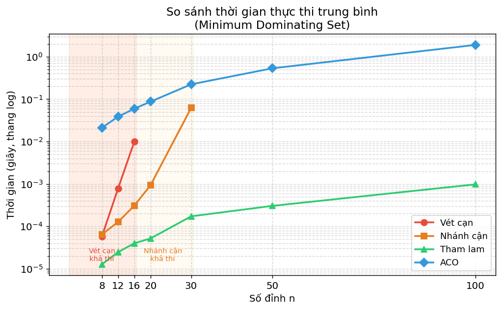
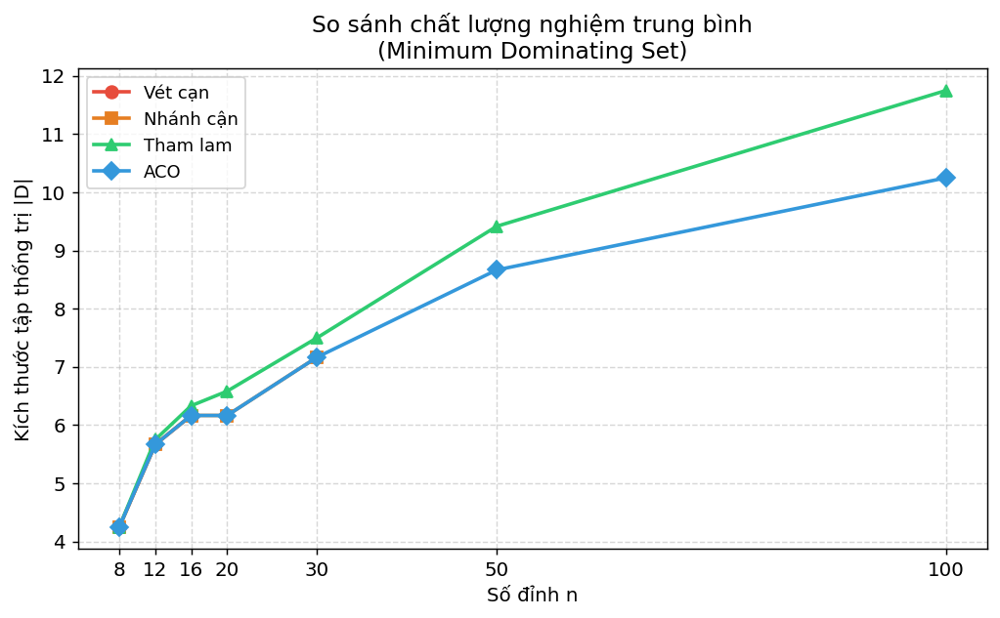

# Bài Toán Tập Thống Trị Tối Thiểu (Minimum Dominating Set)

> Project cuối kỳ môn **Thiết Kế và Đánh Giá Thuật Toán**

---

## Mô tả bài toán

Cho đồ thị vô hướng $G = (V, E)$, tìm tập $D \subseteq V$ có kích thước nhỏ nhất sao cho mọi đỉnh $v \notin D$ đều có ít nhất một hàng xóm thuộc $D$.

**Ứng dụng thực tế:** Đặt số đồn cảnh sát **ít nhất** tại các giao lộ/khu vực sao cho mỗi nơi hoặc có đồn, hoặc kề với ít nhất một nơi có đồn.

---

## Các thuật toán được cài đặt

| Thuật toán | File | Độ phức tạp | Tối ưu? |
|---|---|---|---|
| Vét cạn (Brute Force) | `src/brute_force.py` | $O(2^n \cdot n)$ | ✅ Có |
| Nhánh cận (Branch & Bound) | `src/branch_bound.py` | $O(2^n)$ worst-case | ✅ Có |
| Tham lam (Greedy) | `src/greedy.py` | $O(n(n+m))$ với cài đặt hiện tại | ❌ Xấp xỉ |
| Tối ưu đàn kiến (ACO) | `src/aco.py` | $O(\text{iter} \cdot \text{ant} \cdot n^2)$ | ❌ Xấp xỉ |

### Vét cạn
Thử toàn bộ $2^n$ tập con, kiểm tra từng tập từ nhỏ đến lớn. Tập hợp lệ đầu tiên chính là nghiệm tối ưu. Đảm bảo chính xác tuyệt đối nhưng chỉ khả thi với $n \leq 16$.

### Nhánh cận
Duyệt cây tìm kiếm theo chiều sâu. Tại mỗi nút tìm đỉnh $u$ chưa được thống trị, sau đó phân nhánh: thêm $u$ hoặc một trong các hàng xóm của $u$ vào $D$. Cắt nhánh khi $|D_{\text{hiện tại}}| + \text{LowerBound} \geq \text{best}$. Cài đặt dùng nghiệm Greedy làm cận trên ban đầu để cắt nhánh sớm hơn. Nhanh hơn vét cạn nhiều lần trong thực nghiệm, nhưng hiệu quả vẫn phụ thuộc cấu trúc đồ thị.

### Tham lam
Mỗi bước chọn đỉnh chưa nằm trong $D$ mà phủ được nhiều đỉnh chưa được thống trị nhất (bản thân + hàng xóm chưa bị phủ). Rất nhanh, nhưng không đảm bảo tối ưu. Có thể nhìn bài toán như một trường hợp của Set Cover, với tỉ lệ xấp xỉ $H(\Delta+1) \leq \ln(\Delta+1)+1$ lần nghiệm tối ưu.

### ACO (Ant Colony Optimization)
Mỗi "kiến" xây dựng lời giải bằng cách chọn đỉnh theo xác suất dựa trên pheromone $\tau$ và heuristic động $\eta =$ số đỉnh mới được phủ nếu chọn đỉnh đó. Sau mỗi vòng lặp, pheromone bốc hơi và được bồi đắp từ các lời giải tốt. Áp dụng thêm **local search** (loại đỉnh dư thừa) sau mỗi kiến để cải thiện chất lượng.

$$P(v) = \frac{\tau(v)^\alpha \cdot \eta(v)^\beta}{\sum_{u} \tau(u)^\alpha \cdot \eta(u)^\beta}$$

---

## Cấu trúc thư mục

```
minimum-dominating-set-algorithms/
├── src/
│   ├── greedy.py          # Thuật toán tham lam
│   ├── brute_force.py     # Vét cạn
│   ├── branch_bound.py    # Nhánh cận
│   └── aco.py             # ACO
├── data/
│   └── test_graphs.json   # Đồ thị test (sinh tự động)
├── results/
│   ├── raw/
│   │   └── results.csv          # Số liệu thô
│   ├── comparison/
│   │   └── summary.txt          # Bảng so sánh
│   └── plots/
│       ├── time_comparison.png  # Biểu đồ thời gian
│       └── size_comparison.png  # Biểu đồ chất lượng nghiệm
├── main.py                # Script chạy benchmark & lưu kết quả
├── requirements.txt
└── .gitignore
```

---

## Cách chạy

### Yêu cầu
- Python ≥ 3.8
- matplotlib (để vẽ biểu đồ)

```bash
pip install matplotlib
```

### Chạy benchmark

```bash
python main.py
```

Sau khi chạy xong, kết quả được lưu tự động vào thư mục `results/` và `data/`.

---

## Kết quả thực nghiệm

Benchmark mặc định dùng đồ thị ngẫu nhiên với nhiều mật độ cạnh:

- `edge_prob = [0.05, 0.10, 0.30, 0.50]`
- `seed = [0, 1, 2]`
- `n = [8, 12, 16, 20, 30, 50, 100]`

Kết quả chi tiết được lưu tại:

- `results/raw/results.csv`: số liệu từng lần chạy, gồm `n`, `edge_prob`, `seed`, `algo`, `time`, `size`, `valid`, `opt_size`, `gap`
- `results/comparison/summary.txt`: bảng trung bình theo từng `edge_prob` và `n`

Trong đó:

- `|D|` là kích thước tập thống trị tìm được
- `gap = |D| - OPT`, chỉ có khi một thuật toán chính xác chạy được trên cùng đồ thị
- `—` nghĩa là thuật toán không chạy ở kích thước đó để tránh thời gian quá lớn

### Biểu đồ thời gian thực thi


### Biểu đồ chất lượng nghiệm


---

## Kết luận

| Tiêu chí | Vét cạn | Nhánh cận | Tham lam | ACO |
|---|:---:|:---:|:---:|:---:|
| Nghiệm tối ưu | ✅ | ✅ | ❌ | ❌ |
| Dùng được n lớn | ❌ | ⚠️ | ✅ | ✅ |
| Tốc độ | Chậm nhất | Chậm | Nhanh nhất | Trung bình |
| Chất lượng xấp xỉ | — | — | Khá | Phụ thuộc tham số, có thể tốt hơn Greedy |

**Khi nào dùng thuật toán nào?**
- $n \leq 16$: **Vét cạn** — đơn giản, chắc chắn tối ưu
- $16 < n \leq 30$: **Nhánh cận** — vẫn tối ưu, tốc độ chấp nhận được
- $n > 30$: **Tham lam** (ưu tiên tốc độ) hoặc **ACO** (thử tìm nghiệm tốt hơn, đổi lại thời gian chạy lớn hơn)
